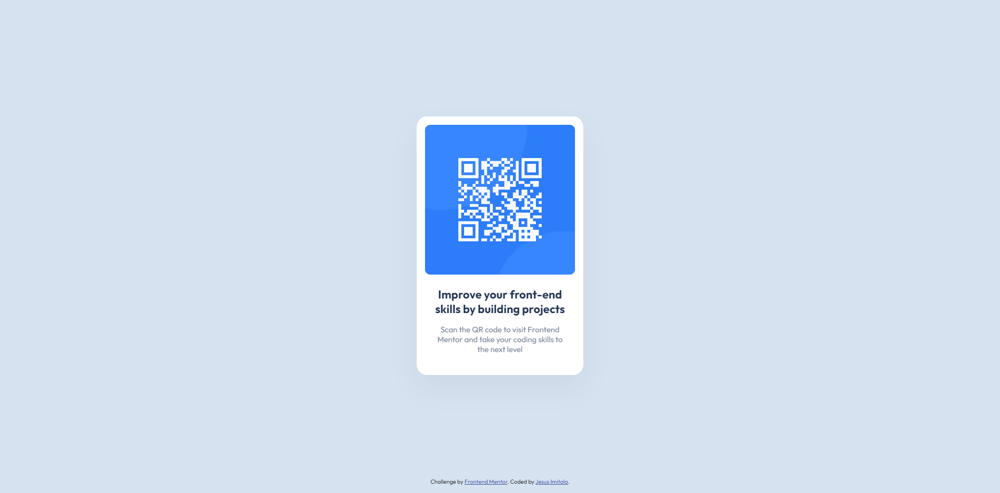

# Frontend Mentor - QR code component solution

This is a solution to the [QR code component challenge on Frontend Mentor](https://www.frontendmentor.io/challenges/qr-code-component-iux_sIO_H). Frontend Mentor challenges help you improve your coding skills by building realistic projects.

## Table of contents

- [Overview](#overview)
  - [Screenshot](#screenshot)
  - [Links](#links)
- [My process](#my-process)
  - [Built with](#built-with)
- [Author](#author)

## Overview

### Screenshot

### Links

- Solution URL: [https://github.com/jgimitola/fm-qr-code-challenge](https://github.com/jgimitola/fm-qr-code-challenge)
- Live Site URL: [https://fm-qr-code-challenge-sand.vercel.app/](https://fm-qr-code-challenge-sand.vercel.app/)

## My process

### Built with

- Semantic HTML5 markup
- CSS custom properties
- Flexbox
- Mobile-first workflow
- [React](https://reactjs.org/) - JS library
- [Next.js](https://nextjs.org/) - React framework

## Author

- Website - [jgimitola](https://github.com/jgimitola)
- Frontend Mentor - [@jgimitola](https://www.frontendmentor.io/profile/jgimitola)
